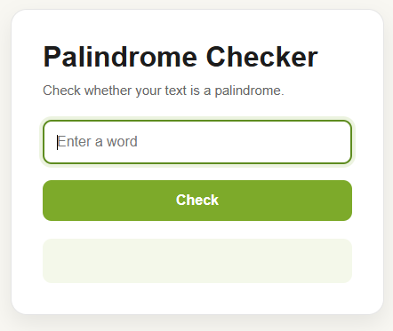

<h1 align="center">Palindrome Checker</h1>


<p align="center">
A simple web application that checks whether a word or piece of text reads the same forwards and backwards. Built with HTML, CSS, and JavaScript while practicing string manipulation and DOM interaction.
</p>

<p align="center">
  <a href="https://palinchecker.netlify.app/">🚀 Live Demo</a> •
  <a href="https://github.com/chitrangna-dev/palindrome-checker">💻 Source Code</a>
</p>

---

## 📸 Preview

<p align="center">
  
</p>

---

## 🎥 Demo

<p align="center">
  
</p>

---

## ✨ Features

- Checks whether the entered text is a palindrome
- Case-insensitive comparison (`Madam` and `madam` are treated the same)
- Instant result with no page reload
- Color-coded feedback — green for a match, red for not, orange for empty input
- Responsive layout for desktop and mobile

**Note:** the check compares the string as-is after lowercasing it, so it works best for single words. Phrases with spaces or punctuation (e.g. "race car" or "A man, a plan, a canal, Panama") won't be detected as palindromes yet — see Possible Improvements below.

---

## 🛠 Built With

- HTML5
- CSS3
- JavaScript (ES6)

---

## 🚀 Getting Started

Clone the repository:
```bash
git clone https://github.com/chitrangna-dev/palindrome-checker.git
```

Move into the project folder:
```bash
cd palindrome-checker
```

Open `index.html` in your preferred web browser.

---

## 💡 Why I Built This

I built this while learning JavaScript to get more comfortable with string manipulation — reversing strings, comparing them, and updating the DOM based on the result without reloading the page.

---

## 🔧 Possible Improvements

- Strip spaces and punctuation before comparing, so full sentences work correctly
- Add a character counter or live-typing check instead of a submit button
- Highlight the mismatched characters when a string isn't a palindrome

---

## 👨‍💻 Author

**Chitrangna**
Learning Web Development one project at a time.
Feel free to explore the project, share feedback, or contribute through pull requests.

---

## 📄 License

This project is licensed under the MIT License.
